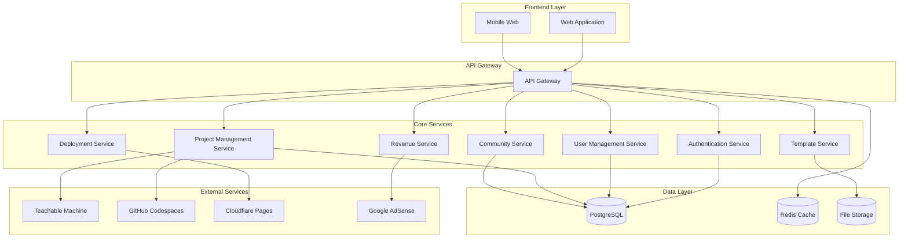
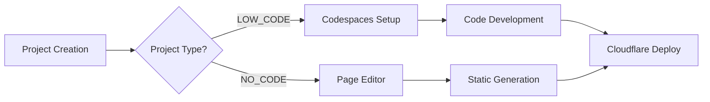

# Design Document

## Overview

AI 서비스 개발 및 수익화 플랫폼은 사용자가 AI 서비스를 쉽게 만들고 배포하며 수익을 창출할 수 있도록 돕는 통합 웹 플랫폼입니다. 플랫폼은 마이크로서비스 아키텍처를 기반으로 하며, 외부 서비스들(Teachable Machine, GitHub Codespaces, Cloudflare Pages, AdSense)과의 연동을 통해 완전한 개발-배포-수익화 워크플로우를 제공합니다.

## Architecture

### High-Level Architecture



### Service Architecture Pattern

각 마이크로서비스는 다음 패턴을 따릅니다:
- **Controller Layer**: HTTP 요청 처리 및 응답
- **Service Layer**: 비즈니스 로직 처리
- **Repository Layer**: 데이터 접근 및 외부 API 연동
- **Model Layer**: 데이터 모델 정의

### Dependency Injection Architecture

플랫폼은 tsyringe 기반의 의존성 주입 패턴을 사용합니다:

- **Container Management**: tsyringe 컨테이너를 통한 서비스 생명주기 관리
- **Decorator Pattern**: `@injectable()` 데코레이터를 통한 서비스 등록
- **Constructor Injection**: 생성자를 통한 의존성 주입
- **Singleton Pattern**: 서비스들은 싱글톤으로 관리되어 메모리 효율성 확보

```typescript
@injectable()
export class AuthController {
  constructor(@inject(AuthService) private authService: AuthService) {}
}
```

### Project Type System

플랫폼은 두 가지 프로젝트 타입을 지원합니다:

#### Low-Code Projects
- GitHub Codespaces 기반 개발 환경
- AI 모델 연동 및 커스텀 코드 작성
- 복잡한 로직 구현 가능

#### No-Code Projects  
- 웹 UI 기반 페이지 에디터
- 정적 HTML 페이지 자동 생성
- 코딩 지식 없이 빠른 배포 가능

## Components and Interfaces

### 1. Authentication Service

**책임**: 사용자 인증 및 권한 관리

**주요 기능**:
- JWT 기반 인증
- OAuth 2.0 (Google, GitHub) 연동
- 역할 기반 접근 제어 (RBAC)

**API Endpoints**:
```
POST /auth/login
POST /auth/register
POST /auth/refresh
POST /auth/logout
GET /auth/profile
```

### 2. User Management Service

**책임**: 사용자 프로필 및 설정 관리

**주요 기능**:
- 사용자 프로필 관리
- 계정 설정
- 알림 설정

**API Endpoints**:
```
GET /users/profile
PUT /users/profile
GET /users/settings
PUT /users/settings
```

### 3. Project Management Service

**책임**: AI 서비스 프로젝트 생성 및 관리

**주요 기능**:
- 프로젝트 CRUD 작업
- AI 모델 연동 관리
- 프로젝트 상태 추적

**API Endpoints**:
```
GET /projects
POST /projects
GET /projects/{id}
PUT /projects/{id}
DELETE /projects/{id}
POST /projects/{id}/ai-model
GET /projects/{id}/status
```

**External Integrations**:
- Teachable Machine API 연동
- GitHub Codespaces API 연동

### 4. Deployment Service

**책임**: 서비스 배포 및 호스팅 관리

**주요 기능**:
- 자동 코드 생성
- GitHub Codespaces 환경 생성
- Cloudflare Pages 배포
- 배포 상태 모니터링

**API Endpoints**:
```
POST /deploy/{projectId}
GET /deploy/{projectId}/status
GET /deploy/{projectId}/logs
POST /deploy/{projectId}/rollback
```

**External Integrations**:
- GitHub Codespaces API
- Cloudflare Pages API
- GitHub API (코드 저장소 관리)

### 5. Revenue Service

**책임**: 수익화 및 광고 관리

**주요 기능**:
- AdSense 계정 연동
- 수익 데이터 수집 및 분석
- 수익 대시보드 데이터 제공

**API Endpoints**:
```
POST /revenue/adsense/connect
GET /revenue/dashboard/{projectId}
GET /revenue/analytics/{projectId}
PUT /revenue/settings/{projectId}
```

**External Integrations**:
- Google AdSense API
- Google Analytics API

### 6. Template Service

**책임**: 템플릿 및 예제 관리

**주요 기능**:
- 템플릿 라이브러리 관리
- 성공 사례 관리
- 템플릿 기반 프로젝트 생성

**API Endpoints**:
```
GET /templates
GET /templates/{id}
GET /templates/categories
POST /projects/from-template/{templateId}
GET /success-stories
```

### 7. Community Service

**책임**: 커뮤니티 기능 관리

**주요 기능**:
- 포럼 및 Q&A 관리
- 프로젝트 공유 및 평가
- 사용자 상호작용

**API Endpoints**:
```
GET /community/posts
POST /community/posts
GET /community/posts/{id}
PUT /community/posts/{id}
DELETE /community/posts/{id}
POST /community/posts/{id}/comments
GET /community/projects/shared
POST /community/projects/{id}/share
```

## Data Models

### User Model
```typescript
interface User {
  id: string;
  email: string;
  username: string;
  profileImage?: string;
  role: 'user' | 'admin';
  settings: UserSettings;
  createdAt: Date;
  updatedAt: Date;
}

interface UserSettings {
  notifications: {
    email: boolean;
    push: boolean;
  };
  privacy: {
    profilePublic: boolean;
    projectsPublic: boolean;
  };
}
```

### Project Model
```typescript
interface Project {
  id: string;
  userId: string;
  name: string;
  description: string;
  category: string;
  status: 'draft' | 'developing' | 'deployed' | 'archived';
  projectType: 'LOW_CODE' | 'NO_CODE';
  pageContent?: {
    title: string;
    heading: string;
    body: string;
    imageUrl?: string;
  };
  aiModel?: AIModelConfig;
  deploymentConfig?: DeploymentConfig;
  revenueConfig?: RevenueConfig;
  createdAt: Date;
  updatedAt: Date;
}

interface AIModelConfig {
  type: 'teachable-machine' | 'huggingface' | 'custom';
  modelUrl: string;
  modelId: string;
  configuration: Record<string, any>;
}

interface DeploymentConfig {
  platform: 'cloudflare-pages' | 'vercel' | 'netlify';
  repositoryUrl: string;
  deploymentUrl?: string;
  lastDeployedAt?: Date;
}

interface RevenueConfig {
  adsenseEnabled: boolean;
  adsensePublisherId?: string;
  adUnits: AdUnit[];
}
```

### Template Model
```typescript
interface Template {
  id: string;
  name: string;
  description: string;
  category: string;
  difficulty: 'beginner' | 'intermediate' | 'advanced';
  tags: string[];
  codeTemplate: string;
  aiModelType: string;
  previewImages: string[];
  usageCount: number;
  rating: number;
  createdAt: Date;
}
```

### Community Post Model
```typescript
interface CommunityPost {
  id: string;
  userId: string;
  type: 'question' | 'showcase' | 'discussion';
  title: string;
  content: string;
  tags: string[];
  votes: number;
  comments: Comment[];
  projectId?: string;
  createdAt: Date;
  updatedAt: Date;
}

interface Comment {
  id: string;
  userId: string;
  content: string;
  votes: number;
  createdAt: Date;
}
```

## Error Handling

### Error Response Format
```typescript
interface ErrorResponse {
  error: {
    code: string;
    message: string;
    details?: Record<string, any>;
    timestamp: string;
    requestId: string;
  };
}
```

### Error Categories

1. **Authentication Errors** (4xx)
   - `AUTH_001`: Invalid credentials
   - `AUTH_002`: Token expired
   - `AUTH_003`: Insufficient permissions

2. **Validation Errors** (4xx)
   - `VAL_001`: Invalid input format
   - `VAL_002`: Missing required fields
   - `VAL_003`: Business rule violation

3. **External Service Errors** (5xx)
   - `EXT_001`: Teachable Machine API error
   - `EXT_002`: GitHub Codespaces API error
   - `EXT_003`: Cloudflare Pages API error
   - `EXT_004`: AdSense API error

4. **System Errors** (5xx)
   - `SYS_001`: Database connection error
   - `SYS_002`: Internal server error
   - `SYS_003`: Service unavailable

### Error Handling Strategy

- **Circuit Breaker Pattern**: 외부 서비스 장애 시 자동 차단
- **Retry Mechanism**: 일시적 오류에 대한 자동 재시도
- **Graceful Degradation**: 일부 기능 장애 시에도 핵심 기능 유지
- **Error Logging**: 모든 오류를 구조화된 로그로 기록

## Testing Strategy

### 1. Unit Testing
- **Coverage Target**: 80% 이상
- **Framework**: Jest (Node.js), React Testing Library (Frontend)
- **Mock Strategy**: 외부 API 호출은 모두 모킹

### 2. Integration Testing
- **API Testing**: Postman/Newman을 활용한 API 테스트
- **Database Testing**: 테스트 데이터베이스를 활용한 데이터 계층 테스트
- **External Service Testing**: 실제 외부 서비스와의 연동 테스트

### 3. End-to-End Testing
- **Framework**: Cypress
- **Test Scenarios**: 
  - 사용자 회원가입부터 AI 서비스 배포까지 전체 플로우
  - 수익화 설정 및 대시보드 확인
  - 커뮤니티 기능 사용

### 4. Performance Testing
- **Load Testing**: Artillery.js를 활용한 부하 테스트
- **Stress Testing**: 시스템 한계점 확인
- **Monitoring**: New Relic 또는 DataDog을 활용한 성능 모니터링

### 5. Security Testing
- **OWASP ZAP**: 웹 애플리케이션 보안 취약점 스캔
- **Dependency Scanning**: npm audit, Snyk을 활용한 의존성 보안 검사
- **Authentication Testing**: JWT 토큰 보안 및 권한 검증

## Security Considerations

### 1. Authentication & Authorization
- JWT 토큰 기반 인증 (Access Token + Refresh Token)
- 역할 기반 접근 제어 (RBAC)
- OAuth 2.0 소셜 로그인 지원

### 2. Data Protection
- 개인정보 암호화 저장
- HTTPS 강제 사용
- API 요청 속도 제한 (Rate Limiting)

### 3. External API Security
- API 키 안전한 저장 (환경 변수)
- 외부 API 호출 시 타임아웃 설정
- 민감한 데이터 로깅 방지

### 4. Input Validation
- 모든 사용자 입력 검증
- SQL Injection 방지
- XSS 공격 방지

## Scalability Design

### 1. Horizontal Scaling
- 마이크로서비스별 독립적 스케일링
- 로드 밸런서를 통한 트래픽 분산
- 컨테이너 기반 배포 (Docker + Kubernetes)

### 2. Database Scaling
- 읽기 전용 복제본 활용
- 데이터베이스 샤딩 (필요시)
- 캐싱 전략 (Redis)

### 3. CDN & Caching
- 정적 자산 CDN 배포
- API 응답 캐싱
- 브라우저 캐싱 최적화

### 4. Monitoring & Alerting
- 실시간 성능 모니터링
- 자동 알림 시스템
- 로그 중앙화 관리
##
 Technology Stack Updates

### Backend Architecture Enhancements

#### Dependency Injection System
- **Container**: tsyringe 기반 DI 컨테이너
- **Lifecycle**: 싱글톤 패턴으로 서비스 관리
- **Decorators**: @injectable() 데코레이터 활용
- **Injection**: 생성자 기반 의존성 주입

#### GitHub Integration
- **Library**: @octokit/rest v20+
- **Features**: Codespaces API, Repository management
- **Authentication**: GitHub token 기반 인증

#### Metadata Support
- **Library**: reflect-metadata
- **Purpose**: 데코레이터 메타데이터 처리
- **Integration**: tsyringe와 연동

### Project Type Architecture

#### Low-Code Projects
```typescript
interface LowCodeProject extends Project {
  projectType: 'LOW_CODE';
  aiModel: AIModelConfig;
  deployment: {
    codespaceId: string;
    repositoryUrl: string;
    codespaceUrl: string;
  };
}
```

#### No-Code Projects
```typescript
interface NoCodeProject extends Project {
  projectType: 'NO_CODE';
  pageContent: {
    title: string;
    heading: string;
    body: string;
    imageUrl?: string;
  };
}
```

### Static Page Generation

No-Code 프로젝트를 위한 정적 페이지 생성 시스템:

```typescript
export function generateStaticPage(pageContent: PageContent): string {
  // HTML 템플릿 기반 정적 페이지 생성
  // Tailwind CSS 스타일링 적용
  // 반응형 디자인 지원
}
```

### Deployment Architecture

#### Project Type Based Deployment
- **Low-Code**: GitHub Codespaces → Cloudflare Pages
- **No-Code**: Static HTML Generation → Direct Deployment

#### Deployment Flow
