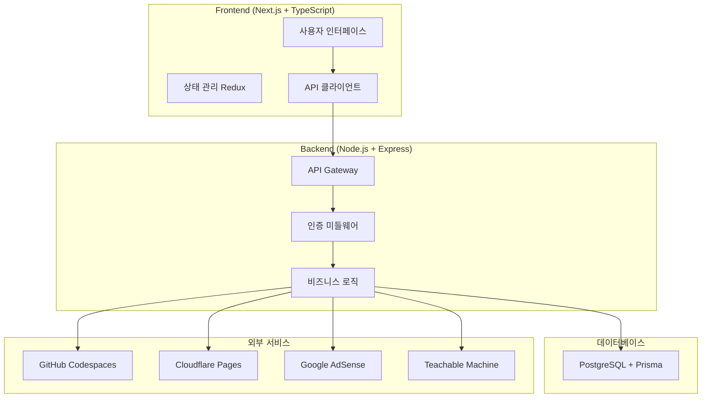
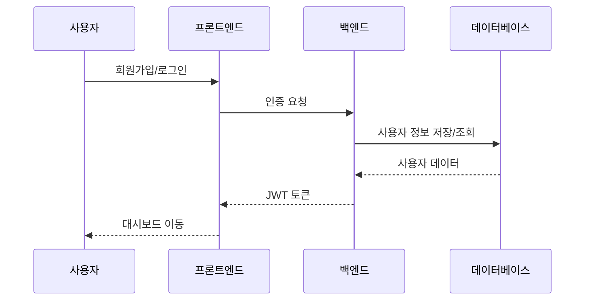
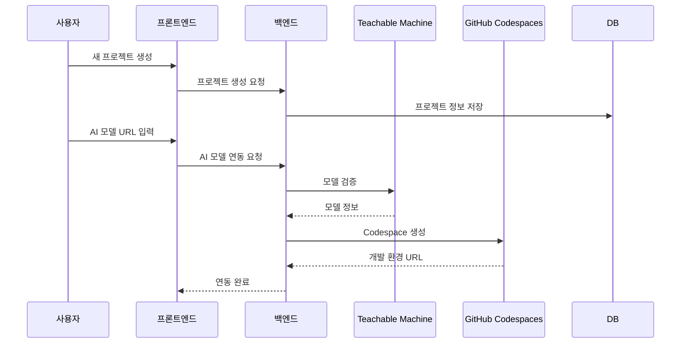
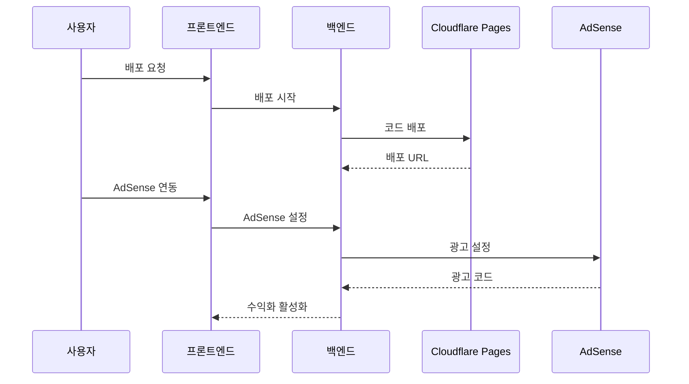
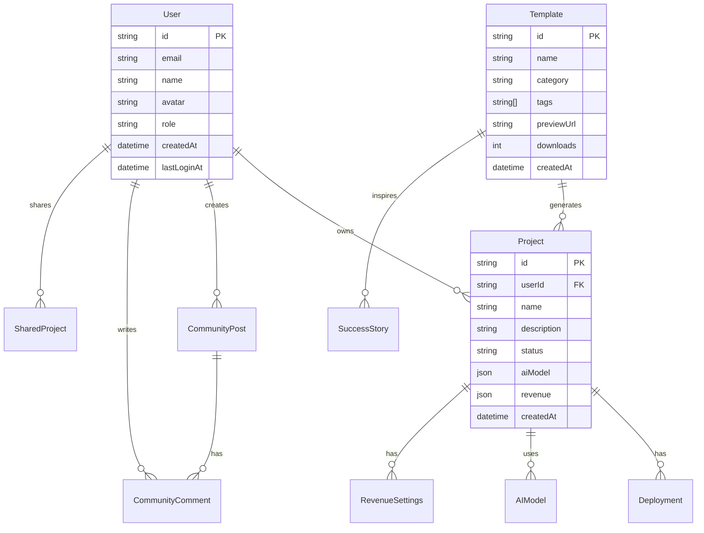
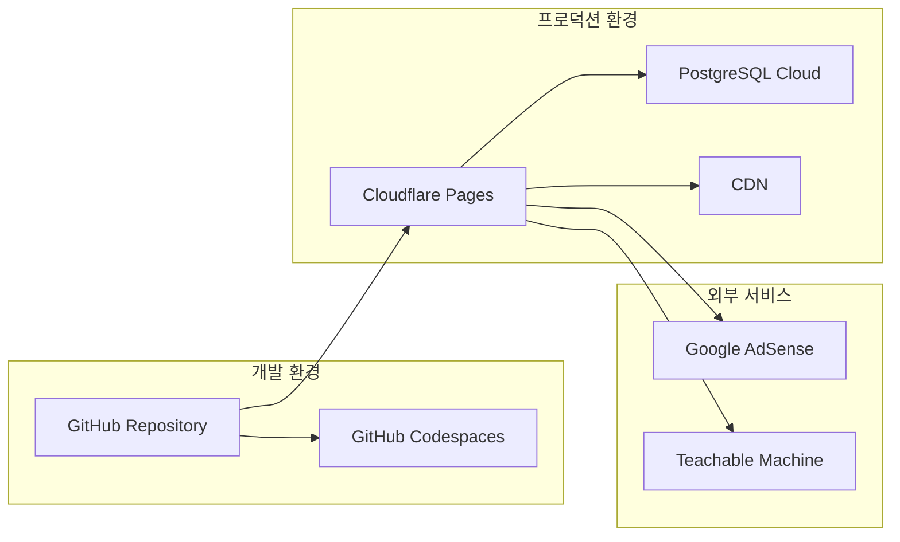

# AI 서비스 플랫폼 - 프로젝트 개요

## 🎯 프로젝트 목표
AI 모델을 활용한 웹 애플리케이션을 쉽게 생성, 배포, 수익화할 수 있는 통합 플랫폼

## 🏗️ 시스템 아키텍처



## 📁 프로젝트 구조

```
ai-service-platform/
├── packages/
│   ├── frontend/                 # Next.js 프론트엔드
│   │   ├── src/
│   │   │   ├── pages/           # 페이지 컴포넌트
│   │   │   ├── components/      # 재사용 컴포넌트
│   │   │   ├── services/        # API 서비스
│   │   │   ├── store/           # Redux 상태 관리
│   │   │   └── styles/          # 스타일링
│   │   └── public/              # 정적 파일
│   ├── backend/                 # Node.js 백엔드
│   │   ├── src/
│   │   │   ├── controllers/     # API 컨트롤러
│   │   │   ├── services/        # 비즈니스 로직
│   │   │   ├── middleware/      # 미들웨어
│   │   │   ├── utils/           # 유틸리티
│   │   │   └── lib/             # 라이브러리
│   │   └── prisma/              # 데이터베이스 스키마
│   └── shared/                  # 공통 타입/상수
└── .kiro/specs/                 # 프로젝트 명세서
```

## 🔄 사용자 플로우

### 1. 사용자 온보딩


### 2. 프로젝트 생성 및 AI 모델 연동


### 3. 배포 및 수익화


## 🎨 주요 기능 모듈

### 1. 인증 시스템
- **JWT 기반 인증**: Access Token + Refresh Token
- **OAuth 2.0**: Google, GitHub 소셜 로그인
- **보호된 라우트**: 인증 미들웨어로 API 보호

### 2. 프로젝트 관리
- **CRUD 작업**: 프로젝트 생성, 조회, 수정, 삭제
- **AI 모델 연동**: Teachable Machine API 통합
- **개발 환경**: GitHub Codespaces 자동 생성

### 3. 배포 시스템
- **코드 생성**: AI 모델 기반 웹 앱 코드 자동 생성
- **클라우드 배포**: Cloudflare Pages 자동 배포
- **모니터링**: 배포 상태 및 로그 실시간 추적

### 4. 수익화 플랫폼
- **AdSense 연동**: Google AdSense 계정 연결
- **수익 대시보드**: 실시간 수익 통계 및 분석
- **최적화 도구**: AI 기반 광고 위치 최적화

### 5. 템플릿 라이브러리
- **템플릿 브라우저**: 카테고리별 템플릿 검색
- **성공 사례**: 수익화 성공 사례 공유
- **템플릿 기반 생성**: 기존 템플릿으로 빠른 프로젝트 시작

### 6. 커뮤니티 플랫폼
- **포럼 시스템**: Q&A, 토론, 튜토리얼 공유
- **프로젝트 갤러리**: 완성된 프로젝트 공유 및 평가
- **투표 시스템**: 게시글/댓글 추천 기능

### 7. 관리자 대시보드
- **플랫폼 통계**: 사용자, 프로젝트, 수익 통계
- **사용자 관리**: 사용자 활동 모니터링 및 지원
- **콘텐츠 관리**: 신고 처리 및 콘텐츠 검토

## 🛠️ 기술 스택

### Frontend
- **Framework**: Next.js 13+ (App Router)
- **Language**: TypeScript
- **Styling**: Tailwind CSS
- **State Management**: Redux Toolkit
- **UI Components**: Radix UI + shadcn/ui
- **Charts**: Recharts

### Backend
- **Runtime**: Node.js
- **Framework**: Express.js
- **Language**: TypeScript
- **Database**: PostgreSQL
- **ORM**: Prisma
- **Authentication**: JWT + Passport.js

### DevOps & Deployment
- **Development**: GitHub Codespaces
- **Deployment**: Cloudflare Pages
- **Database**: PostgreSQL (Cloud)
- **Monitoring**: Custom logging system

### External APIs
- **AI Models**: Google Teachable Machine
- **Monetization**: Google AdSense
- **Version Control**: GitHub API
- **Cloud Services**: Cloudflare API

## 📊 데이터베이스 스키마



## 🚀 배포 아키텍처



## 📈 성능 최적화

### Frontend 최적화
- **코드 분할**: Next.js 자동 코드 스플리팅
- **이미지 최적화**: Next.js Image 컴포넌트
- **캐싱**: SWR을 통한 데이터 캐싱
- **번들 최적화**: Tree shaking 및 압축

### Backend 최적화
- **데이터베이스**: 인덱싱 및 쿼리 최적화
- **캐싱**: Redis를 통한 세션 및 데이터 캐싱
- **API 최적화**: 페이지네이션 및 필터링
- **로드 밸런싱**: Cloudflare를 통한 트래픽 분산

## 🔒 보안 고려사항

### 인증 보안
- **JWT 토큰**: 짧은 만료 시간 + Refresh Token
- **HTTPS**: 모든 통신 암호화
- **CORS**: 적절한 CORS 정책 설정
- **Rate Limiting**: API 호출 제한

### 데이터 보안
- **입력 검증**: Zod를 통한 스키마 검증
- **SQL Injection**: Prisma ORM 사용
- **XSS 방지**: 입력 데이터 sanitization
- **CSRF 방지**: CSRF 토큰 사용

## 📱 반응형 디자인

### 모바일 우선 설계
- **Breakpoints**: sm(640px), md(768px), lg(1024px), xl(1280px)
- **터치 최적화**: 버튼 크기 및 간격 조정
- **네비게이션**: 모바일 햄버거 메뉴
- **성능**: 모바일 네트워크 최적화

## 🧪 테스트 전략

### 단위 테스트
- **Frontend**: Jest + React Testing Library
- **Backend**: Jest + Supertest
- **Coverage**: 80% 이상 코드 커버리지 목표

### 통합 테스트
- **API 테스트**: 전체 API 엔드포인트 테스트
- **E2E 테스트**: Playwright를 통한 사용자 플로우 테스트
- **성능 테스트**: 로드 테스트 및 스트레스 테스트

## 📋 개발 프로세스

### 1. 요구사항 분석
- 사용자 스토리 작성
- 기능 명세서 작성
- UI/UX 디자인

### 2. 설계 및 아키텍처
- 시스템 아키텍처 설계
- 데이터베이스 스키마 설계
- API 명세서 작성

### 3. 개발 및 구현
- 백엔드 API 개발
- 프론트엔드 컴포넌트 개발
- 외부 서비스 연동

### 4. 테스트 및 배포
- 단위/통합 테스트 작성
- 성능 최적화
- 프로덕션 배포

## 🎯 향후 확장 계획

### Phase 1 (현재)
- ✅ 기본 플랫폼 구축
- ✅ AI 모델 연동
- ✅ 배포 시스템
- ✅ 수익화 기능

### Phase 2 (예정)
- 🔄 모바일 앱 개발
- 🔄 PWA 구현
- 🔄 고급 분석 도구
- 🔄 다국어 지원

### Phase 3 (계획)
- 📋 AI 모델 마켓플레이스
- 📋 협업 기능
- 📋 화이트라벨 솔루션
- 📋 엔터프라이즈 기능

---

## 📞 연락처 및 지원

- **개발팀**: dev@ai-service-platform.com
- **기술지원**: support@ai-service-platform.com
- **문서**: https://docs.ai-service-platform.com
- **GitHub**: https://github.com/ai-service-platform

---

*이 문서는 AI 서비스 플랫폼의 전체적인 구조와 흐름을 설명합니다. 각 모듈의 상세한 구현 내용은 해당 디렉토리의 README 파일을 참조하세요.*